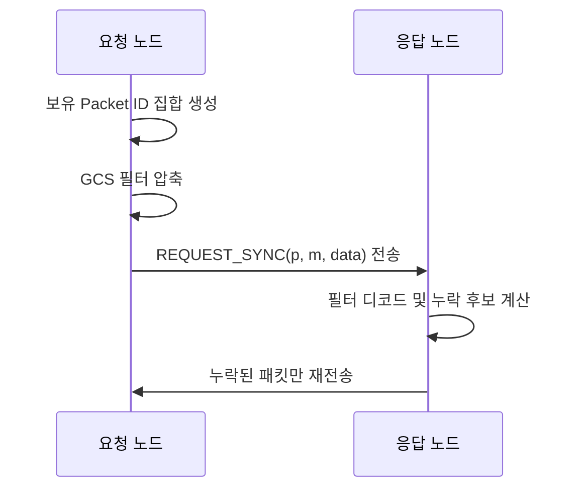

# 동기화

## 목적
메쉬 환경에서 노드별 수신 시점 차이로 발생하는 누락 데이터를, 전체 재전송 없이 선택 복구합니다.

## 적용 범위
- 최신 `ANNOUNCE`
- 브로드캐스트 `MESSAGE`

## 동작 방식

## 파라미터
- 기본 필터 크기: `256 bytes`
- 기본 목표 오탐률(FPR): `1.0%`
- 수용 가능한 최대 필터 크기: `1024 bytes`
- 초기 동기화 지연: `5초`
- 주기 동기화 간격: `30초`

## 기대 효과
- 누락분만 교환하므로 동기화 트래픽 절감
- 접속/이탈이 잦은 메쉬 환경에서 복구 속도 개선
