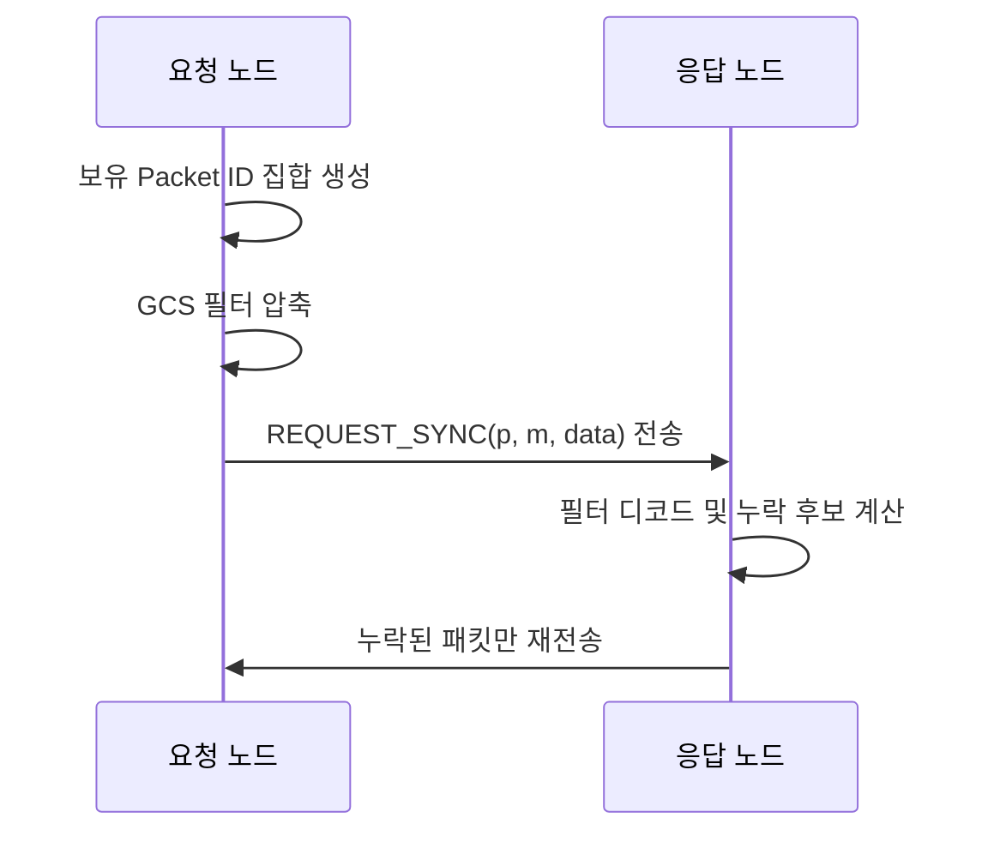

# 동기화

## 목적
메쉬 환경에서 노드별 수신 시점 차이로 발생하는 누락 데이터를, 전체 재전송 없이 선택 복구합니다.

## 적용 범위
- 최신 `ANNOUNCE`
- 브로드캐스트 `MESSAGE`

## 동작 방식

## 파라미터
| 항목 | 설정값 | 설정 근거 | 코드 위치 |
|---|---|---|---|
| 기본 필터 크기 | `256 bytes` | 소규모 메쉬에서 필터 정확도와 패킷 크기 균형을 맞춘 기본값 | [SyncDefaults.DEFAULT_FILTER_BYTES](../../shared/src/main/java/com/example/lifesaiver/protocol/sync/SyncDefaults.kt) |
| 기본 목표 오탐률(FPR) | `1.0%` | 오탐으로 인한 불필요 재전송을 억제하면서 필터 크기 증가를 완화 | [SyncDefaults.DEFAULT_FPR_PERCENT](../../shared/src/main/java/com/example/lifesaiver/protocol/sync/SyncDefaults.kt) |
| 수용 가능한 최대 필터 크기 | `1024 bytes` | 저대역폭 구간에서도 동기화 패킷이 과도하게 커지지 않도록 상한 제한 | [SyncDefaults.MAX_ACCEPT_FILTER_BYTES](../../shared/src/main/java/com/example/lifesaiver/protocol/sync/SyncDefaults.kt) |
| 초기 동기화 지연 | `5초` | 앱 시작 직후 연결/announce 안정화 시간을 확보해 초기 버스트를 완화 | [GossipSyncManager.scheduleInitialSync()](../../shared/src/main/java/com/example/lifesaiver/protocol/sync/GossipSyncManager.kt) |
| 주기 동기화 간격 | `30초` | 배터리 소모를 억제하면서 누락 복구 지연을 과도하게 늘리지 않는 주기 | [GossipSyncManager.start()](../../shared/src/main/java/com/example/lifesaiver/protocol/sync/GossipSyncManager.kt) |

## 기대 효과
- 누락분만 교환하므로 동기화 트래픽 절감
- 접속/이탈이 잦은 메쉬 환경에서 복구 속도 개선
